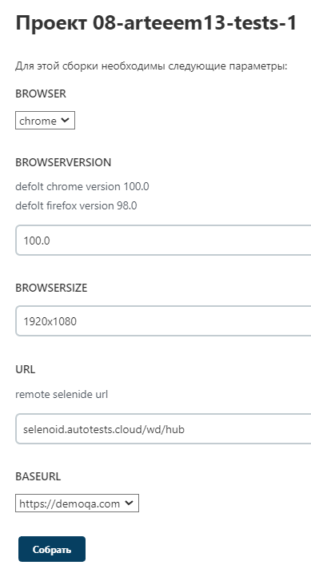

## ***В данном проекте реализовано:***
### 
- скопирован код из demoqa_tests для доработки
- передан из jenkins адрес удаленного браузера
- добавлена параметризация:

- передача логина и пароля из jenkins в созданный properties файл, и его в коде с помощью библиотеки owner